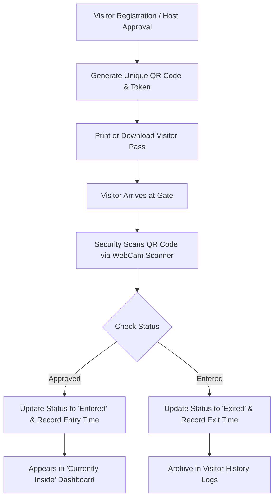

# 🚀 SmartGate-Pro: Advanced QR-Based Visitor Management System

[](https://react.dev/)
[](https://nodejs.org/)
[](https://www.mysql.com/)
[](https://tailwindcss.com/)
[](LICENSE)

**SmartGate-Pro** is a modern, full-stack, enterprise-ready **Visitor Management System (VMS)** designed to digitize, secure, and streamline entry/exit verification in residential complexes, corporate offices, and institutions. 

It replaces traditional paper logbooks with automated **UUID-backed QR codes**, real-time camera scanning, **Role-Based Access Control (RBAC)** across Admin, Security, and Customer roles, and live occupancy tracking.

---

## ✨ Key Features

- 🔐 **Role-Based Access Control (RBAC)**: Distinct access levels and personalized navigation for **Admin**, **Security**, and **Customer** users.
- 🔑 **Secure Authentication**: Password hashing with `bcryptjs` and tokenized authorization using **JSON Web Tokens (JWT)**.
- 👤 **Visitor Pre-Registration & Approval**: Simple visitor entry form with instant status management (`Pending`, `Approved`, `Entered`, `Exited`, `Rejected`).
- 🎟️ **Instant QR Code Generation**: Server-side creation of unique Base64-encoded QR codes using `uuid` and `qrcode`.
- 🖨️ **Printable Visitor Passes**: Clean, printable pass layout with visitor details, host information, and scannable QR token.
- 📷 **Live WebCam QR Scanner**: Instant camera scanning powered by `html5-qrcode` to verify visitor passes in real time.
- ⏱️ **Real-Time Entry & Exit Tracking**: Automated timestamping (`entry_time`, `exit_time`) upon QR scan verification.
- 🏢 **"Currently Inside" Occupancy Monitor**: Live dashboard displaying all visitors currently checked in within the facility.
- 📊 **Interactive Analytics Dashboard**: Overview cards, status breakdown charts, recent activities, and quick actions.
- 🔍 **Searchable Visitor Logs**: Filter, search, and paginate complete historical visitor records.

---

## 🛠️ Tech Stack

### **Frontend**
- **Framework**: React 19 + Vite
- **Routing**: React Router DOM v7
- **Styling**: Tailwind CSS v4, Vanilla CSS3 (Custom Glassmorphism & Themes)
- **Icons**: React Icons
- **HTTP Client**: Axios (with Request/Response Interceptors)
- **QR Scanner**: `html5-qrcode`

### **Backend**
- **Runtime**: Node.js
- **Framework**: Express.js (v5)
- **Database**: MySQL (`mysql2` pool & promise-based queries)
- **Security**: `jsonwebtoken` (JWT), `bcryptjs` (Password Hashing), `cors`, `dotenv`
- **Utilities**: `qrcode` (QR Code Generator), `uuid` (v4 Unique Tokens)

---

## 📂 Repository Structure

```
SmartGate-Pro/
├── backend/
│   ├── config/
│   │   └── db.js            # MySQL Connection Pool configuration
│   ├── controllers/
│   │   ├── authController.js   # User Login & Signup logic
│   │   └── visitorController.js# Visitor CRUD, QR Verification, Entry/Exit
│   ├── routes/
│   │   ├── authRoutes.js    # Authentication API routes
│   │   └── visitorRoutes.js # Visitor management & scan routes
│   ├── server.js            # Express application entry point
│   └── package.json
│
├── frontend/
│   ├── src/
│   │   ├── components/      # Navbar, Sidebar, ErrorBoundary
│   │   ├── pages/           # Dashboard, AddVisitor, ScanQR, Visitors, CurrentlyInside, VisitorPass
│   │   ├── services/        # Axios API client setup
│   │   ├── styles/          # Modular CSS and Tailwind imports
│   │   ├── App.jsx          # Route declarations & Role Guard routing
│   │   └── main.jsx         # React application entry point
│   └── package.json
│
├── database.sql             # Database schema initialization script
└── README.md
```

---

## 🔄 Visitor Workflow



---

## 🚀 Quick Start & Setup

### 1️⃣ Clone the Repository
```bash
git clone https://github.com/shyamsaikumar-436/SmartGate-Pro.git
cd SmartGate-Pro
```

### 2️⃣ Database Setup
1. Ensure MySQL server is running.
2. Run `database.sql` script to create database and tables:
```sql
SOURCE path/to/database.sql;
```

### 3️⃣ Backend Setup
```bash
cd backend
npm install
```
Create a `.env` file in the `backend/` directory:
```env
PORT=5000
DB_HOST=localhost
DB_USER=root
DB_PASSWORD=your_mysql_password
DB_NAME=smartgate
JWT_SECRET=your_jwt_secret_key
```
Start the backend server:
```bash
npm run dev
```

### 4️⃣ Frontend Setup
In a new terminal window:
```bash
cd frontend
npm install
npm run dev
```
Open your browser at `http://localhost:5173`.

---

## 📡 API Endpoints Summary

### **Auth Routes (`/api/auth`)**
| Method | Endpoint | Description |
| :--- | :--- | :--- |
| `POST` | `/signup` | Register new user (*customer*, *security*, *admin*) |
| `POST` | `/login` | Authenticate user & return JWT token |

### **Visitor Routes (`/api/visitors`)**
| Method | Endpoint | Description |
| :--- | :--- | :--- |
| `POST` | `/add` | Register a new visitor & generate QR token |
| `GET` | `/all` | Fetch complete visitor history |
| `GET` | `/currently-inside` | List visitors currently inside premises |
| `GET` | `/scan/:qrToken` | Verify visitor QR token state |
| `PUT` | `/update-status/:id` | Update visitor entry/exit status |

---

## 👨‍💻 Developer Information

**P. Shyam Sai Kumar**  
🎓 *B.Tech – Computer Science and Engineering (AI & ML)*  
🏫 *SRM University – AP*  
🔗 [GitHub Profile](https://github.com/shyamsaikumar-436)

---

⭐ **If you find this repository useful, please consider giving it a Star!**